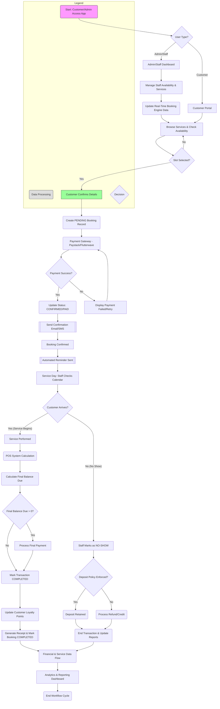

# salon

```mermaid
flowchart TD
    %% Define Node Shapes for Clarity
    subgraph Legend
        style A fill:#f9f,stroke:#333
        style B fill:#ddd,stroke:#333
        style D3 fill:#9f9,stroke:#333
        A[Start: Access App]
        B(Data Processing)
        C{Decision}
        D3[[Action/Output]]
    end
    
    %% 1. Initial Access & Setup
    A(Start: Customer/Admin Access App) --> B_Type{User Type?};

    B_Type -- Admin/Staff --> C_Dash[Admin/Staff Dashboard];
    B_Type -- Customer --> D_Portal[Customer Portal];

    C_Dash --> C1[Manage Staff Availability & Services];
    C1 --> C2(Update Real-Time Booking Engine Data);
    C2 --> D1; 

    %% 2. Customer Booking & Payment (Phase 1)
    D_Portal --> D1[Browse Services & Check Availability];
    D1 --> D2{Slot Selected?};
    D2 -- No --> D1;
    D2 -- Yes --> D3[Customer Confirms Details];
    D3 --> D4(Create PENDING Booking Record);
    D4 --> D5(Payment Gateway - Paystack/Flutterwave);
    D5 --> D6{Payment Success?};

    D6 -- Yes --> D7(Update Status: CONFIRMED/PAID);
    D7 --> D8[[Send Confirmation Email/SMS]];
    D8 --> E[Booking Confirmed];

    D6 -- No --> D9[Display Payment Failed/Retry];
    D9 --> D5; 

    %% 3. Service Day Management (Phase 3)
    E --> F[[Automated Reminder Sent]];
    F --> G[Service Day: Staff Checks Calendar];
    G --> H{Customer Arrives?};

    H -- No (No Show) --> I[Staff Marks as NO-SHOW];
    I --> J{Deposit Policy Enforced?};
    J -- Yes --> K(Deposit Retained);
    J -- No --> L(Process Refund/Credit);
    K & L --> M(End Transaction & Update Reports);

    H -- Yes (Service Begins) --> N[Service Performed];
    N --> O(POS System Calculation);

    O --> P(Calculate Final Balance Due);
    P --> Q{Final Balance Due > 0?};

    Q -- Yes --> R[Process Final Payment];
    Q -- No --> S(Mark Transaction COMPLETED);

    R --> S;
    S --> T(Update Customer Loyalty Points);
    T --> U[[Generate Receipt & Mark Booking COMPLETED]];

    %% 4. Reporting & System Cycle
    U & M --> V(Financial & Service Data Flow);
    V --> W[Analytics & Reporting Dashboard];
    W --> X(End Workflow Cycle);
```
